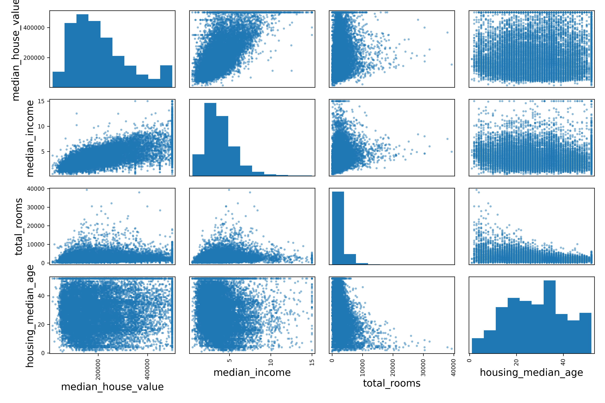
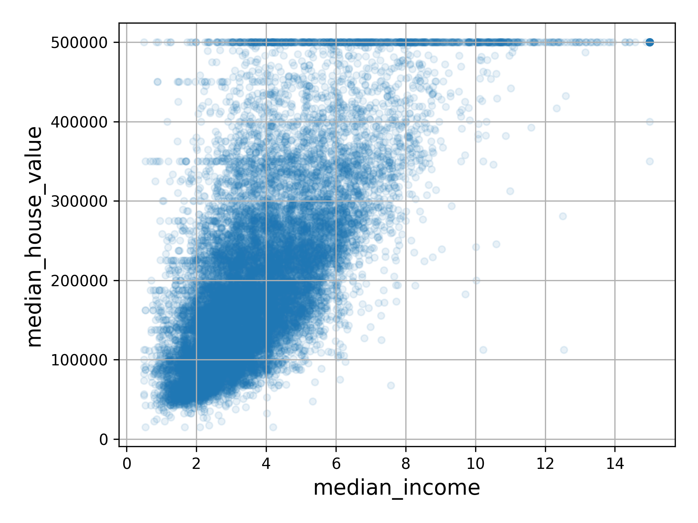

### 날짜: 2024-05-02 04:03
----
### 설명:
현재 사용중인 데이터셋의 크기가 너무 크지 않으므로, 모든 특성 간의 **표준 상관계수**$^{standard}$ $^{correlation}$ $^{coefficient}$를 `corr()`메서드를 이용하여 간단하게 계산할 수 있다
```python
corr_matrix = housing.corr(numeric_only=True)
```
___
어떠한 한 속성을 기준으로 다른 속성들과의 상관관계를 알고 싶다면, 다음과 같은 방법을 사용할 수 있다
```python
corr_matrix[<속성 이름>].sort_values(ascending=False)
```

따라서, 중간 주택 가격(median_house_value)와 다른 특성 사이의 상관관계를 다음과 같이 확인할 수 있다.
```python
corr_matrix["median_house_value"].sort_values(ascending=False)
```
출력은 다음과 같다
```
median_house_value    1.000000
median_income         0.688380
total_rooms           0.137455
housing_median_age    0.102175
households            0.071426
total_bedrooms        0.054635
population           -0.020153
longitude            -0.050859
latitude             -0.139584
Name: median_house_value, dtype: float64
```
---
- 상관관계는 [-1, 1]의 범위를 가진다
- 상관관계가 1에 가까우면 강한 양의 상관관계를 가진다는 뜻이다
- 예시에서는, median_house_value에 대하여 median_income의 상관관계가 0.688380이니 중간 주택 가격(median_house_value)는 중간 소득(median_income)이 올라갈 때 증가하는 경향이 있다.
- latitude와는 약한 음의 상관관계를 보인다(북쪽으로 갈 수록 가격이 조금씩 내려가는 경향이 있다)
- 상관관계가 0에 가까우면 선형적인 상관관계가 없다는 뜻이다
---
특성 사이의 상관관계를 확인하기 위하여, `pandas`의 `scatter_matrix()`함수를 사용하여 여러 가지 특성들에 대하여 각각 서로의 상관관계를 산점도로 그려볼 수 있다.

다음 예시에서는 중간 주택 가격과의 상관관계가 높아 보이는 특성들 간의 상관관계를 점선도로 그리는 예시이다
```python
corr_matrix["median_house_value"].sort_values(ascending=False)
attributes = ["median_house_value", "median_income", "total_rooms",
              "housing_median_age"]
scatter_matrix(housing[attributes], figsize=(12, 8))
save_fig("scatter_matrix_plot")  # 추가 코드
plt.show()
```


- 위 행렬의 대각선 위치에는 각 변수 자신에 대한 산점도가 출력되어야 함.
- 하지만 이는 그냥 직선(자기 자신과의 상관관계는 1이기 때문이다)이여서 유용하지 않음
- 따라서 pandas는 각 특성의 히스토그램을 대신 그린다.(다른 옵션도 가능)
---
산점도 행렬을 보면, 중간 주택 가격을 예측하는 데 중간 소득이 가장 유용해 보인다.
```python
housing.plot(kind="scatter", x="median_income", y="median_house_value",
             alpha=0.1, grid=True)
plt.show()
```


- 이 그래프에서 가격의 한계값이 $500,000에서의 수평선으로 관측됨
- $450,000 근처, $350,000 근처와 $280,000 에서도 보인다
- 이런 경우 알고리즘이 이런 이상한 형태를 학습하지 않도록 해당 구역을 재거할 수 있다
---
#### 주의:
상관계수는 오직 선형적인 상관관계만 측정한다. 즉, 비선형적인 관계는 알 수 없다.

